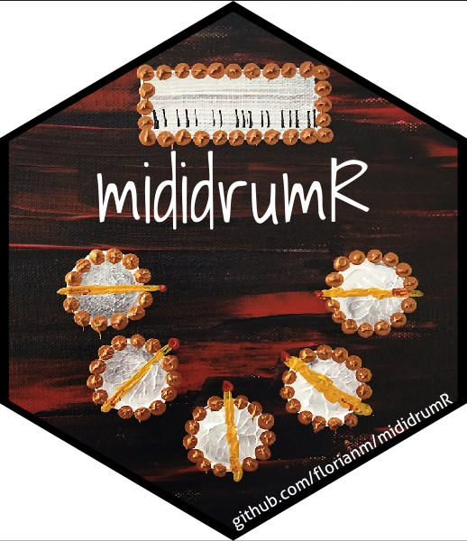

<!-- README.md is generated from README.Rmd. Please edit that file -->

```{r setup, include = FALSE}
knitr::opts_chunk$set(
  collapse = TRUE,
  comment = "#>",
  fig.path = "man/figures/",
  out.width = "100%")
```

# `mididrumR`: Play drums and smash some R 

<!-- badges: start -->
<!-- badges: end -->

How does a drummer build R packages? With MIDI triggering the package build shortcuts of course.

This (non-)package targets the broad majority of R package developing drummers who
wish to combine the useful (practicing drums on their Yamaha DTXplorer e-drumkit) 
with the fun stuff (documenting, building, testing R packages).

It does so by providing an annotated shell script which listens to MIDI sources 
and maps selected notes to keyboard shortcuts.

<!-- Vimeo video: live demo -->

In our example, we connect a 
Yamaha DTXplorer electronic drumkit ([MIDI map](https://gist.github.com/Linux-cpp-lisp/0d56704764b95424bf7e))
via a Roland UM-ONE MIDI to USB cable ([product page](https://www.roland.com/au/products/um-one_mk2/)
and [reference and driver downloads](https://www.roland.com/au/products/um-one_mk2/downloads/))
to a Ubuntu machine.

The provided script can be used with any other MIDI source (e.g. an electronic piano), 
any other MIDI cable, trigger arbitrary keyboard shortcuts or type keyboard commands, 
and drive any other software beyond RStudio or system functionality.


## Installation
View `vignette("install", package="mididrumR")` for in-depth installation steps.

On a Ubuntu system, install `aseqdump` and `xdotool`.

```{sh, eval=FALSE}
sudo apt install -y aseqdump xdotool
```

Then, deploy a copy of the script, edit, and adjust to taste.
Choose the destination for the copy of the script with `dir`, and whether to
overwrite an existing file of that name in `dir` with `overwrite`.

```{r, eval=FALSE}
library(mididrumR)
deploy_script(dir = "~", overwrite = FALSE)
```

Lastly, run `mididrumR.sh`, focus the input on RStudio, and play drums. 
Hitting cymbals, toms or the snare will run various package build commands.


