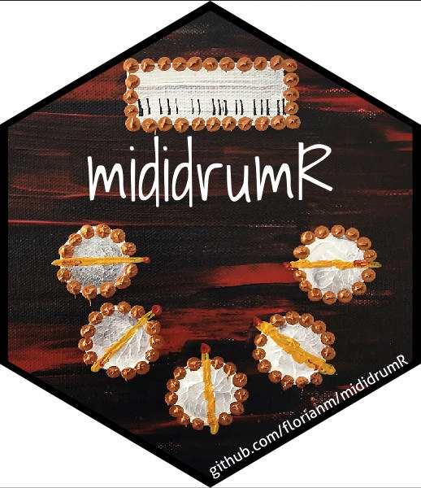

<!-- README.md is generated from README.Rmd. Please edit that file -->

# `mididrumR`: Play drums and smash some R 

<!-- badges: start -->
<!-- badges: end -->

How does a drummer build R packages? With MIDI triggering the package
build shortcuts of course.

This (non-)package targets the broad majority of R package developing
drummers who wish to combine the useful (practicing drums on their
Yamaha DTXplorer e-drumkit) with the fun stuff (documenting, building,
testing R packages).

<!-- Vimeo video: live demo -->

## Installation

View `vignette("install", package="mididrumR")` for in-depth
installation steps.

On a Ubuntu system, install `aseqdump` and `xdotool`.

``` sh
sudo apt install -y aseqdump xdotool
```

Then, deploy a copy of the script, edit, and adjust to taste.

``` r
library(mididrumR)
deploy_script()
```

Lastly, run `mididrumR.sh`, focus on RStudio, and play drums. Hitting
cymbals, toms or the snare will run various package build commands.
